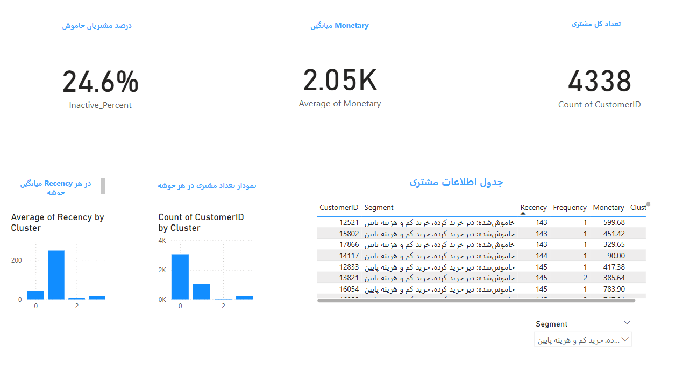

# Customer Segmentation & Lifetime Value Prediction 🧠

🎯 هدف پروژه: تحلیل رفتاری مشتریان یک فروشگاه آنلاین و پیش‌بینی ارزش طول عمر آن‌ها جهت بهینه‌سازی بازاریابی

## 🔧 ابزارهای استفاده‌شده

- Python (Pandas, Scikit-learn, Streamlit)
- SQL + Excel
- Power BI (داشبورد تعاملی)
- GitHub for version control

## 📈 مراحل پروژه

1. آماده‌سازی و پاک‌سازی داده‌ها (Online Retail dataset)
2. ساخت مدل RFM برای گروه‌بندی مشتریان
3. خوشه‌بندی با KMeans و تحلیل هر خوشه
4. ساخت مدل پیش‌بینی برای شناسایی مشتریان خاموش
5. طراحی داشبورد با Power BI و اپ تعاملی با Streamlit

## 🚀 خروجی‌ها

- فایل RFM نهایی: `data/rfm_clusters.csv` 
- 📊 داشبورد Power BI (`dashboard.pbix`)
- 🌐 اپ Streamlit (`app/app.py`)
- 📋 تحلیل عددی + نمودارها (Jupyter Notebook)

## 🎯 برای اجرای اپ Streamlit:

```bash
pip install -r app/requirements.txt
streamlit run app/app.py

 🌐 [اجرای اپ آنلاین در Streamlit Cloud]:
https://cbanalytics.streamlit.app/


📌 پروژه Data Analyst / Data Science Intern
